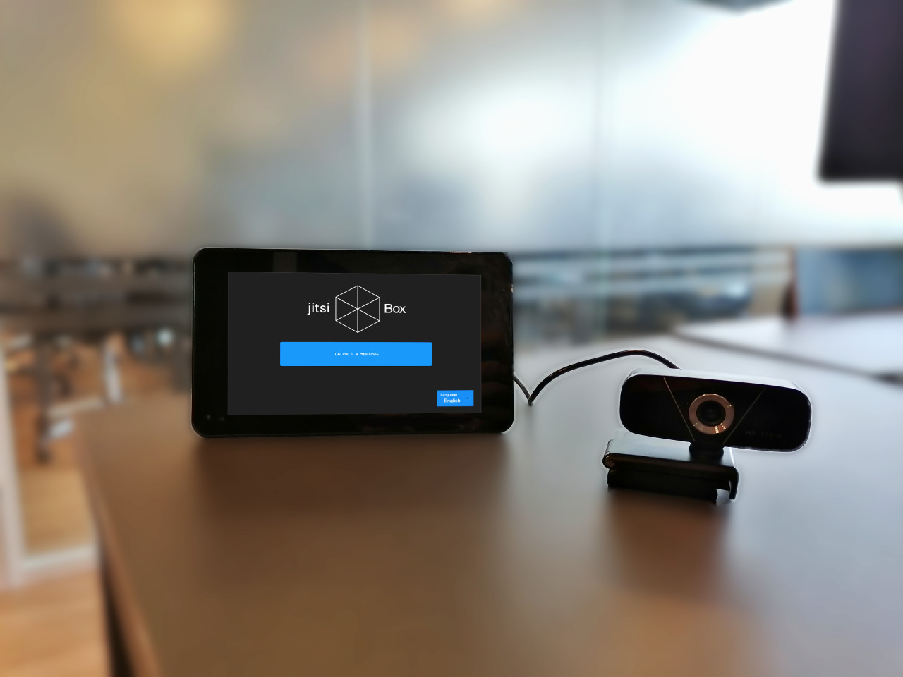

# Jitsi Box, an opensource device for hybrid classrooms and conferences

A **hybrid classroom** combines traditional face-to-face teaching with online teaching.

**Our ambition is to blend the virtual classroom with the real classroom through the use of a simple device called the `Jitsi-Box`**.

Ultimately, the idea is to ensure that online students feel as if they were actually in the classroom with easy interactions with their peers in the class and vice-versa. Furthemore, the Jitsi-Box is designed to give the students an enhanced vision of the whiteboard, so as to help them attend their lessons more easily.

  

The `Jitsi-Box` is a web application with 3 different interfaces each tailored for specific users : 
 - One which allows teachers to connect (with the computer of the classroom) to their online teaching meeting. 
 - One for the Raspberry which should be installed in the classroom. 
 - The last one for the students, where they can crop and filter the image of the whiteboard captured by the 2 previous interfaces (see  section "general overview" for more details).

 The Teacher and Box (Raspberry) interfaces are used to record simultaneously the whiteboard and the classroom. It is recommanded to follow the instructions below for the configuration of the devices in the classroom : 
 
- a sound system to render the sound of the people online
- At least 2 cameras dispersed in the room to film an overview of the classroom but also the whiteboard
- a microphone to record the sound of the classroom and the teacher
- a screen to see the people online within the classroom

All of these outputs can be chosen by he/she who setups the jitsi-box in a room.

A version of the application is available on https://jitsi-box.com

## Architecture

The `Jitsi-box` is made up of 2 essential building blocks: a `React` frontend application, a `FastAPI` backend application.

The interfaces Teacher or Box (Raspberry) are used to send images of the whiteboard at regular intervals. Then, the backend application processes the image (crop and filter), in function of the needs specified by the students. Finally, the server sends the newly processed images to the front applications of the students. 

## Getting Started

### `Raspberry`

For the setup, please see the following **[SETUP](./SETUP.md)**

The `Raspberry Pi` runs the latest Raspbian OS, based on Debian 11 Bullseye.

Because Raspbian switched recently from Buster to Bullseye, there are still many bugs, especially regarding KMS drivers.

For now, in order to use the touchscreen, you must replace line 62 of `/boot/config.txt`: `dtoverlay=vc4-kms-v3d` by `dtoverlay=vc4-fkms-v3d`.

This switches from KMS drivers to Fake-KMS drivers, resolving the uncatched touch-events problem.

The sound also seems to be a problem: when using a microphone attached to a webcam, depending on the brand and the drivers, the microphone may be recognized but no sound is catched. For now, the only solution is to use an external microphone, or a camera that happens to have a compatible microphone.

## Hardware

Almost all of the hardware used in this project is exchangeable with any other that the users consider fit or easier to acquire.

All we aim to do in this section is to present the hardware that we have selected and tested in our prototype.

- **Controller**: Raspberry Pi 4 B with 4 Go of RAM DDR4 (screen+rpi) ~155€
- **Touchscreen**: 7" capacitive touch screen
- **Case**: a suitable case for the touch screen and the raspberry attached to it
- **Camera & Microphone**: Webcam USB Chat Webcam 1080p Full HD (SANDBERG 134-15) (for now the microphone of the webcam doesn’t work) ~35€
- **Speakers**: LOGITECH S120 Speaker (PC, stereo, S120)  ~15€

Feel free to add your tested hardware **[here](./docs/hardware_tested.md)**

## Deployment

For the deployment setup and launch, please see the following **[ReadMe](./staging/README.md)**

## Contributors

This project is an MVP developed by 3 MEng Students from the **Paris Digital Lab** a digital innovation program of CentraleSupélec.

The first team was composed of:

**Mohamed Khairallah Gharbi \
Arthur Naudy \
Simon Maréchal**

A second team continued the project Jitsi-Box : 
**Vianney Ruhlmann \
Adrien Berger \
Fayssal Defaa \
Julien Jacquot **

## Contributions

This project is intended to be community-driven, so any PR is welcome !

## License

This work is released under the `MIT License`.
